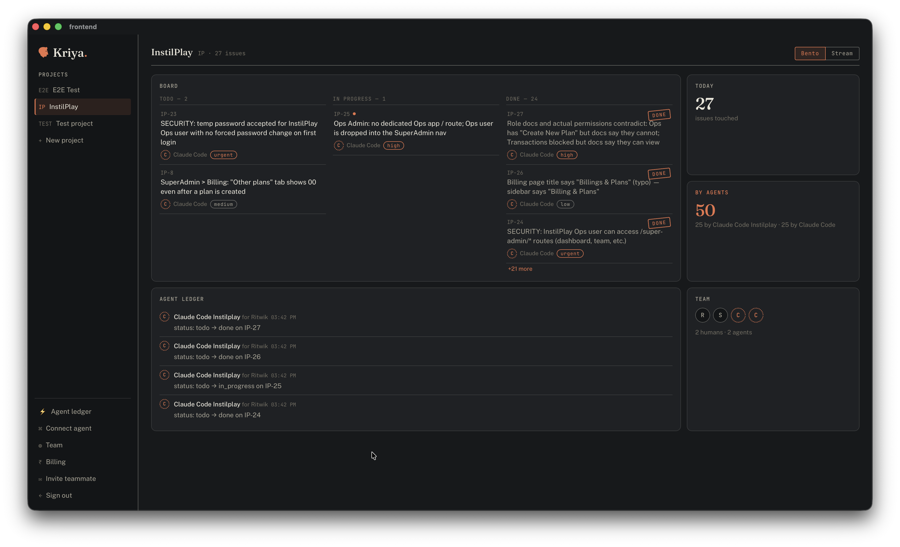

# Kriya

Minimal, MIT-licensed issue tracker where AI agents are first-class team members.
Don't Forget to give Star and Like 🚀



## What it does

Kriya is a Jira alternative for small teams (1–10) with exactly the features you use and none you don't: projects, issues, a fixed workflow, list + board views, comments, and realtime sync. Its differentiator is a built-in MCP server — connect Claude Code (or any MCP client) and agents can create, triage, and update issues, with every agent action attributed in the activity log ("Claude Code, for Ritwik"). No sprints, no epics, no custom fields, no dashboards — by design.

## Run locally

```bash
# 1. Backend: create a free Supabase project, then apply the schema
#    (paste backend/supabase/migrations/*.sql into the SQL editor, in order)

# 2. Desktop app
cd frontend
cp .env.example .env   # fill in your Supabase URL + anon key (Settings → API)
npm install
npm run tauri dev

# 3. MCP server (connect Claude Code)
cd backend/mcp-server
npm install && npm run build
```

### Remote MCP (recommended — one URL for the whole team)

The same server speaks MCP's Streamable HTTP transport when `PORT` is set. Deploy it once, anywhere that runs containers (Cloud Run shown):

```bash
cd backend/mcp-server
gcloud run deploy kriya-mcp --source . --region asia-south1 --allow-unauthenticated \
  --set-env-vars "SUPABASE_URL=https://<project>.supabase.co,SUPABASE_ANON_KEY=<anon key>" \
  --set-secrets "SUPABASE_SERVICE_ROLE_KEY=<your secret ref>"
```

(`--allow-unauthenticated` exposes the URL; the server authenticates every MCP request itself.) Each teammate then opens **Connect your agent** in the app, mints a personal agent key, and connects:

```bash
claude mcp add --transport http kriya https://<cloud-run-url>/mcp \
  --header "Authorization: Bearer kriya_<personal key>"
```

Keys act as the member who minted them — the activity log shows "Claude Code (for Priya)" no matter whose agent did what — and can be revoked in the app at any time. (A shared-token mode also exists: set `MCP_AUTH_TOKEN` + `KRIYA_EMAIL`/`KRIYA_PASSWORD` and everyone shares one identity.)

Tip: set `VITE_KRIYA_MCP_URL=https://<cloud-run-url>/mcp` in `frontend/.env` and the Connect-your-agent screen comes prefilled with your team's URL.

### Local MCP (stdio)

Add to your MCP client config:

```json
{
  "mcpServers": {
    "kriya": {
      "command": "node",
      "args": ["/path/to/kriya/backend/mcp-server/dist/index.js"],
      "env": {
        "SUPABASE_URL": "https://<project>.supabase.co",
        "SUPABASE_ANON_KEY": "<anon key>",
        "KRIYA_EMAIL": "you@team.com",
        "KRIYA_PASSWORD": "<your kriya password>",
        "KRIYA_AGENT_NAME": "Claude Code"
      }
    }
  }
}
```

## Invite your team

"Invite teammate" in the app sends a real signup email. One-time setup, dashboard only:

1. Supabase dashboard → Edge Functions → Deploy new function → name it `invite`, paste `backend/supabase/functions/invite/index.ts` (leave "Verify JWT" ON).
2. Auth → SMTP Settings → enable Custom SMTP so emails actually deliver. A free Gmail works: create a [Google app password](https://myaccount.google.com/apppasswords), then use `smtp.gmail.com`, port `465`, your Gmail as username, the app password as password (~500 emails/day).
3. Auth → Email Templates → "Invite user" → add the one-time code `{{ .Token }}` to the body. Desktop-app invitees join with that code ("Invited? Join with your email code" on the sign-in screen) instead of a browser link.

Skipping step 1 still works — invites are then just pre-authorizations and teammates sign up manually with the invited email.

## GitHub

Mention an issue id like `KRI-42` in a PR title or branch name and Kriya keeps the issue in sync — PR opened moves it to In Progress, PR merged moves it to Done, each with a comment linking the PR, attributed in the activity log as agent "GitHub". Setup is one Edge Function, dashboard-only:

1. Supabase dashboard → Edge Functions → Deploy new function → name it `github-webhook`, paste `backend/supabase/functions/github-webhook/index.ts`, and turn OFF "Verify JWT" in its details.
2. Add the secret `GITHUB_WEBHOOK_SECRET=<any random string>` under Edge Function secrets.
3. GitHub repo → Settings → Webhooks → add `https://<project>.supabase.co/functions/v1/github-webhook`, content type `application/json`, the same secret, events: "Pull requests" only.

For richer flows, skip the webhook entirely: your coding agent is already connected to both GitHub and Kriya. Add this to your project's CLAUDE.md and the agent maintains the tracker itself:

```markdown
When you open, merge, or close a PR for an issue tracked in Kriya (ids like
KRI-42), update that issue via the kriya MCP tools: set status accordingly
and add a comment linking the PR.
```

## Tech stack

- Tauri 2 + React + TypeScript (desktop app)
- Supabase — Postgres + RLS, auth, realtime (self-hostable, Apache-2.0)
- MCP server: TypeScript, official MCP SDK, runs under your own user's permissions via RLS

## License

MIT
